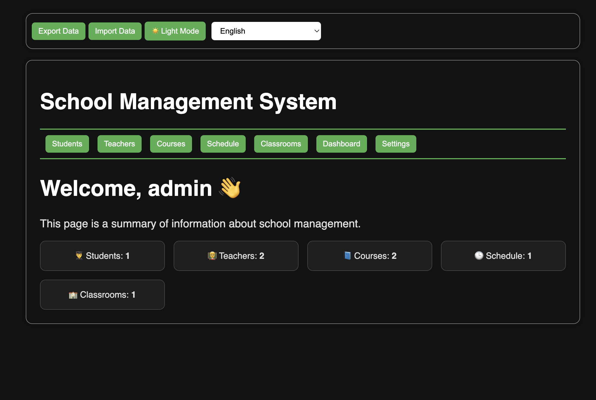

# 🏫 School Management Module (HTML, CSS, JavaScript)

A lightweight, modular, and fully client-side school management system built using only HTML, CSS, and vanilla JavaScript. This app is ideal for learning purposes, internal tools, or small-scale school operations.

---

## 🚀 Features

- 📘 **Modular structure**: Manage Students, Teachers, Courses, Classrooms, and Schedules
- 🌐 **Multilingual support**: English and Turkish with live switching
- 🌗 **Theme switching**: Light and Dark mode support
- 💾 **Persistent data**: All data stored in browser `localStorage`
- 📤 **Export / Import**: Backup and restore data in JSON format
- 🧹 **Data reset**: Clear all local data with a single click
- 📊 **Dashboard**: Overview panel with total counts for each module
- ⚙️ **Settings page**: Central control for theme, language, backup, and more

---

## 📷 Screenshots

### Dashboard

### Student Manager

### Settings Page

---

## 🛠 How to Use

1. **Download or clone** this repo  
2. Open `index.html` in your browser  
3. No build process or server needed. Fully offline.

---

## 🧰 Tech Stack

- HTML5  
- CSS3  
- JavaScript (ES6 Modules)  
- `localStorage` API

